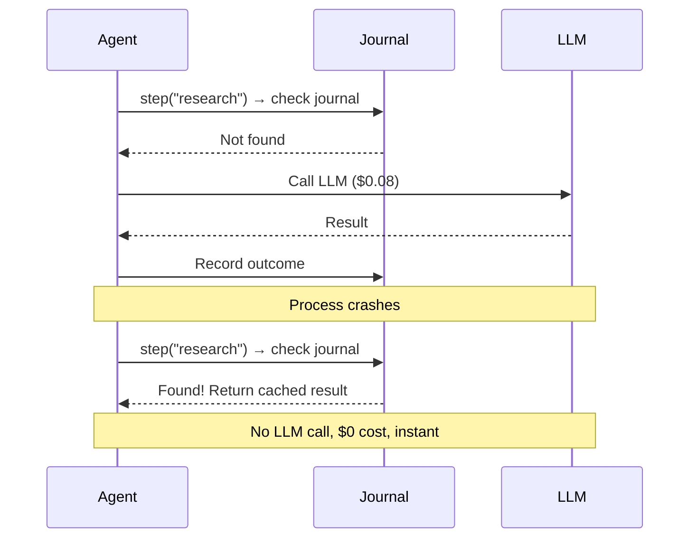

[](https://github.com/antonalag/durable-agents/actions/workflows/ci.yml)
[](https://www.npmjs.com/package/durable-agents)
[](./LICENSE)
[]()

# durable-agents

**Crash recovery for AI agents.** Minimizes wasted LLM calls through outcome caching.

---

## The Problem

AI agents crash. Networks fail, processes die, deployments roll. When a 10-step agent crashes on step 7, you lose everything — **the $0.50 in LLM calls, the 30 seconds of work, and the user's trust.** Most teams either accept the waste or build fragile checkpointing by hand.

## The Solution

**durable-agents** journals every step outcome to durable storage. When a crash happens, the agent resumes from the last journaled step — replaying cached results instantly, minimizing re-execution of expensive LLM calls.



---

## Features

- **Crash recovery** — resume from last journaled step, minimizing re-execution
- **SQLite & PostgreSQL** — journal stores with full CRUD and TTL cleanup
- **LangGraph.js adapter** — `createDurableMiddleware` for graph-based agents
- **AI SDK adapter** — `withDurability` wrapping generateText/streamText
- **Idempotent tools** — at-most-once execution within journal boundary for side-effecting operations
- **Budget enforcement** — cost, steps, and duration limits with graceful stop
- **Loop detection** — same-tool, no-progress, and oscillation patterns
- **Kill switch** — `workflow.terminate(runId, reason)` for immediate abort
- **Web dashboard** — Hono server with htmx and SSE live updates
- **CLI** — `npx durable-agents dashboard` / `npx durable-agents recover`
- **Event hooks** — `workflow.on('budget:warning', handler)`
- **Config validation** — descriptive errors at construction time
- **27.8 KB** core bundle (minified, tree-shakeable)
- **324 tests** with 34 property-based correctness proofs

---

## Comparison

| | durable-agents | Manual Checkpoints | Temporal | Custom Recovery |
|---|---|---|---|---|
| **Setup** | `npm install` + 3 lines | DIY (hours) | Server + workers (days) | Medium effort |
| **Recovery granularity** | Per-step | Per-checkpoint | Per-activity | Varies |
| **Framework support** | LangGraph, AI SDK | Manual | Generic | Manual |
| **Runtime overhead** | 27.8 KB | ~0 | ~50 MB server | Varies |
| **Learning curve** | Minutes | Hours | Days | Hours |
| **Budget/loop controls** | Built-in | DIY | External | DIY |

---

## Quick Start

```bash
npm install durable-agents
```

```typescript
import { DurableWorkflow, SqliteJournalStore } from 'durable-agents';

const store = new SqliteJournalStore('./agent.db');

const workflow = new DurableWorkflow('my-agent', async (ctx, input) => {
  const research = await ctx.step('research', () => searchWeb(input.query));
  const analysis = await ctx.step('analyze', () => analyzeResults(research));
  return analysis;
}, { store, budget: { maxCostUsd: 5.0, maxSteps: 50 } });

const result = await workflow.run({ query: 'durable execution patterns' });
```

If the process crashes after `research` completes, restarting replays that step from the journal — **cached result replayed, no LLM cost for journaled steps.**

---

## Framework Adapters

### LangGraph.js

```typescript
import { createDurableMiddleware } from 'durable-agents/langgraph';

const middleware = createDurableMiddleware({
  store,
  config: { name: 'research-agent' },
});
// Wire hooks into your StateGraph: middleware.beforeAgent, middleware.afterModel, middleware.afterAgent
```

### Vercel AI SDK

```typescript
import { withDurability } from 'durable-agents/ai-sdk';

const result = await withDurability({ store, ctx, eventBus }, 'generate', () =>
  generateText({ model: openai('gpt-4o'), prompt: 'Hello' })
);
```

### Idempotent Tools

```typescript
import { idempotent } from 'durable-agents';

// Within journal boundary: fires at most once per recorded outcome
const result = await idempotent(ctx, 'send-webhook', { url, payload }, () =>
  fetch(url, { method: 'POST', body: JSON.stringify(payload) })
);
```

---

## Dashboard & CLI

```typescript
import { startDashboard } from 'durable-agents/dashboard';
await startDashboard({ store, port: 3100 });
// → http://localhost:3100 — live run monitoring with SSE
```

```bash
npx durable-agents dashboard --port 3100   # Start web dashboard
npx durable-agents recover --db ./agent.db  # Recover stale runs
```

---

## Documentation

- [**Getting Started**](./docs/getting-started.md) — Install, first workflow, crash recovery demo
- [**Core Concepts**](./docs/concepts.md) — Outcome journaling, recovery semantics, operation keys
- [**API Reference**](./docs/api-reference.md) — All public exports with examples
- [**Recovery Guide**](./docs/guides/recovery.md) — Crash detection, replay, auto-recovery
- [**Adapters Guide**](./docs/guides/adapters.md) — LangGraph.js, AI SDK, standalone
- [**Lifecycle Controls**](./docs/guides/lifecycle-controls.md) — Budgets, loops, kill switch
- [**Dashboard Guide**](./docs/guides/dashboard.md) — Web UI, CLI, SSE live updates

---

## Known Limitations

| Limitation | Description |
|---|---|
| **Single-worker recovery** | v0.1.0 assumes a single process performs recovery. Concurrent recovery of the same stale run will produce duplicate step executions with no fencing. |
| **Side-effect window** | A crash between `fn()` returning and `recordOutcome()` persisting causes re-execution on recovery. Use external idempotency keys for non-idempotent side effects. |
| **Post-step budget (maxCostUsd)** | `maxCostUsd` is adapter-dependent: the core `ctx.step` path records `costUsd: 0` for all outcomes. Without a cost-producing adapter (LangGraph, AI SDK), `maxCostUsd` cannot enforce token-cost budgets. Budget enforcement fires AFTER a step completes, before the next step. |

---

## Community

- [GitHub Discussions](https://github.com/antonalag/durable-agents/discussions) — Questions, ideas, show & tell
- [Issues](https://github.com/antonalag/durable-agents/issues) — Bug reports and feature requests
- Discord — Coming soon

## Contributing

Contributions welcome! See [CONTRIBUTING.md](./CONTRIBUTING.md) for guidelines.

## License

MIT
