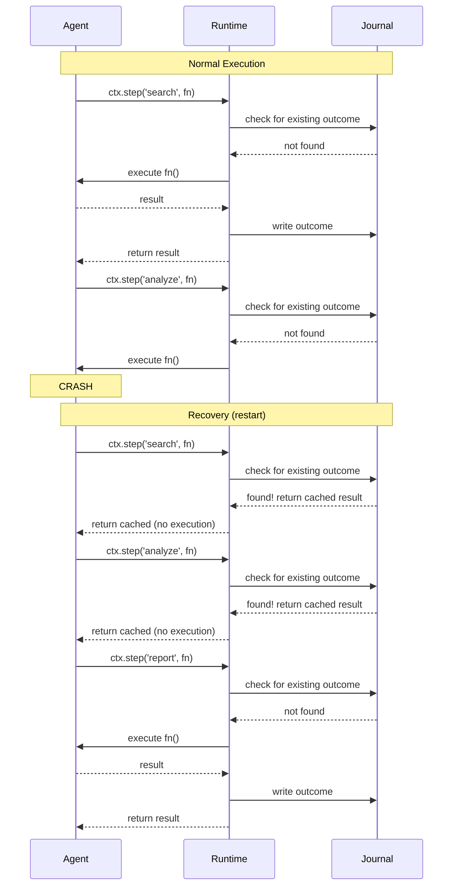

# Introducing durable-agents: Crash Recovery for AI Agents

Your AI agent just crashed on step 7 of 10. That's $0.50 in LLM calls gone. Your user retries, burns another $0.50, and maybe crashes again. Multiply by hundreds of users per day. You're bleeding money and trust — and the only thing your agent remembers is nothing.

There's a better way.

## The Problem

AI agents are stateless by default. Every `generateText()` call, every tool invocation, every chain-of-thought step vanishes the moment your process dies. And processes die all the time — OOM kills, network timeouts, deployment restarts, Lambda cold starts.

The real cost isn't the crash itself. It's the *replay tax*. A research agent that calls GPT-4 ten times at $0.05 per call costs $0.50 per run. If it crashes halfway through, you have two options: retry from scratch (another $0.25+ wasted) or build custom checkpointing logic.

Most teams reach for the obvious "solutions":

- **Try/catch everything** — catches errors, sure, but doesn't survive process death. Your in-memory state is gone.
- **Manual checkpointing** — write intermediate results to a database yourself. Works, but now you're maintaining checkpoint logic alongside business logic. It's brittle, error-prone, and grows quadratically with agent complexity.
- **Just retry** — the default. Wasteful, slow, and your users notice.

None of these actually solve the fundamental problem: your agent has no memory of what it already did.

## The Solution

**durable-agents** brings outcome journaling to AI agents. The concept is simple: before executing any step, check if a result already exists in the journal. If it does, return the cached result. If it doesn't, execute the step and write the result to durable storage.

Think of it like a write-ahead log (WAL) for your agent. Every completed step is a committed transaction. On crash, the recovery engine replays cached results without re-executing anything — no duplicate LLM calls, no wasted tokens, no side effects.

The API surface is minimal. You define steps with `ctx.step(name, fn)`. The runtime handles journaling, recovery, and replay automatically. Your agent code stays clean and focused on its actual job.

```
Normal: step1 → journal → step2 → journal → step3 → journal → done
Crash:  step1 → journal → step2 → journal → [CRASH]
Recover: replay(step1) → replay(step2) → step3 → journal → done
```

Zero LLM calls wasted. Recovery in milliseconds.

## Before vs After

Here's a typical agent without any recovery:

```typescript
// Fragile agent — crashes lose everything
async function researchAgent(query: string) {
  const results = await searchWeb(query);          // $0.05
  const analysis = await analyzeResults(results);  // $0.10
  const report = await generateReport(analysis);   // $0.15
  return report;
}

// If this crashes after analyzeResults, you lose $0.15 and start over.
```

Now the same agent with durable-agents:

```typescript
// Durable agent — crashes recover from journal
import { DurableWorkflow, SqliteJournalStore } from 'durable-agents';

const store = new SqliteJournalStore('./agent.db');

const workflow = new DurableWorkflow('research', async (ctx, input) => {
  const results = await ctx.step('search', () => searchWeb(input.query));
  const analysis = await ctx.step('analyze', () => analyzeResults(results));
  const report = await ctx.step('report', () => generateReport(analysis));
  return report;
}, { store });

// If this crashes after 'analyze', restart replays search + analyze from journal,
// then only re-executes 'report'. Zero wasted LLM calls.
const result = await workflow.run({ query: 'durable execution patterns' });
```

Three lines changed. Full crash recovery. The `ctx.step()` wrapper is all it takes — the runtime handles everything else.

## How Does It Compare?

| Feature | durable-agents | Manual Checkpoints | Temporal | Custom Recovery |
|---------|---------------|-------------------|----------|-----------------|
| Setup complexity | `npm install` + 3 lines | High (DIY) | Heavy (server + workers) | Medium |
| Recovery granularity | Per-step | Per-checkpoint | Per-activity | Varies |
| Framework support | LangGraph, AI SDK | Manual | Generic | Manual |
| Overhead | ~28 KB runtime | Zero library | ~50 MB server | Varies |
| Learning curve | Minutes | Hours | Days | Hours |

Temporal is great for enterprise orchestration, but it's a whole infrastructure commitment — separate server, workers, SDK. For AI agents that just need "don't lose my expensive LLM results," that's overkill.

Manual checkpointing works, but you're writing and maintaining persistence logic by hand. Every new step needs checkpoint code. Every schema change breaks your recovery.

durable-agents sits in the sweet spot: library-level simplicity with infrastructure-level reliability.

## How It Works



The journal is the single source of truth. Steps are identified by deterministic operation keys (SHA-256 hashes of step name + parameters). The runtime checks the journal before every step execution. If a result exists, it's returned immediately — no function execution, no side effects, no cost.

## Getting Started in 3 Minutes

```bash
npm install durable-agents
```

Create a store and wrap your workflow:

```typescript
import { DurableWorkflow, SqliteJournalStore } from 'durable-agents';

const store = new SqliteJournalStore('./agent.db');

const workflow = new DurableWorkflow('my-agent', async (ctx, input) => {
  const data = await ctx.step('fetch', () => fetchData(input.url));
  const summary = await ctx.step('summarize', () => summarize(data));
  return summary;
}, {
  store,
  budget: { maxCostUsd: 2.0, maxSteps: 20 },
  loopDetection: { maxRepetitions: 3 },
});

const result = await workflow.run({ url: 'https://example.com' });
```

That's it. Your agent now journals every step, enforces cost budgets, detects infinite loops, and recovers from crashes automatically.

## What Else Is Included

Beyond the core runtime:

- **Framework adapters** — First-class support for LangGraph.js (`createDurableMiddleware`) and Vercel AI SDK (`withDurability`). Wrap your existing agent in one function call.
- **Budget and loop controls** — Set cost limits, step limits, and duration limits. Detect same-tool loops, no-progress spirals, and oscillation patterns. Kill switch with graceful stop.
- **Web dashboard** — Real-time monitoring via `startDashboard()`. Runs list, step timelines, cost tracking, and SSE live updates.
- **CLI** — `npx durable-agents dashboard` and `npx durable-agents recover` for ops workflows.
- **Tested** — 324 tests including 34 property-based correctness properties via fast-check. Core bundle under 28 KB.

## What's Next

v0.1.0 is the foundation. Here's what's coming:

- **More adapters** — CrewAI, AutoGen, custom framework hooks
- **Cloud stores** — DynamoDB, Turso, Cloudflare D1 for serverless deployments
- **Distributed mode** — Multi-process coordination with leader election
- **Streaming recovery** — Resume streaming LLM responses mid-token
- **v0.2.0** — based on community feedback from early adopters

## Get Involved

```bash
npm install durable-agents
```

- [Star the repo](https://github.com/antonalag/durable-agents) — it helps others find it
- [GitHub Discussions](https://github.com/antonalag/durable-agents/discussions) — questions, ideas, show & tell
- [Issues](https://github.com/antonalag/durable-agents/issues) — bug reports and feature requests
- Contributions welcome — check the issues labeled `good first issue`

Your agents deserve a memory. Give them one.
