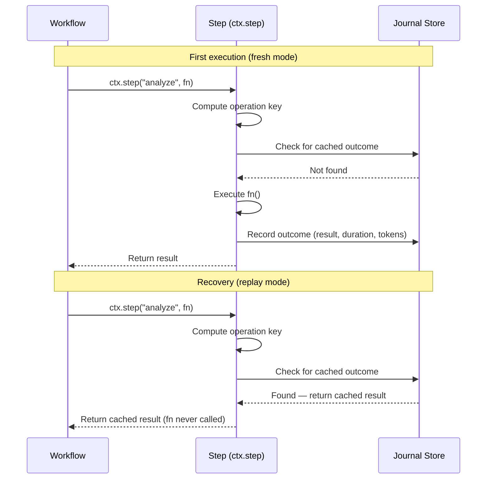

# Core Concepts

This page explains the fundamental ideas behind durable-agents: how your agent's work is persisted, how recovery works after a crash, and how the runtime tracks liveness and prevents runaway behavior.

## Outcome Journaling

Outcome journaling is the core mechanism that makes agent workflows durable. Every time a step executes successfully, its result is recorded to a persistent journal store. If the process crashes and restarts, the runtime replays cached results from the journal instead of re-executing expensive LLM calls.

Think of it as a transaction log for your agent — every completed operation is written to durable storage before the workflow moves on.

### How It Works

1. Your workflow calls `ctx.step(name, fn)`.
2. The runtime computes a deterministic **operation key** for this step.
3. If no cached outcome exists for that key, `fn` executes and the result is recorded.
4. On a subsequent recovery run, the same operation key is found in the journal, so the cached result is returned immediately — `fn` is never called again.



The journal store persists three entities:

- **ExecutionRun** — the top-level workflow execution with status, totals, and config.
- **Step** — an individual operation within a run, ordered by sequence number.
- **OutcomeRecord** — the actual result of a step, keyed by a deterministic operation key.

## Recovery Semantics

When a process crashes mid-execution, recovery brings the workflow back to where it left off. The `RecoveryEngine` handles this by loading all completed outcomes from the journal and building a **replay cursor** — a lookup map of operation keys to their cached results.

### Replay vs Re-Execute

The runtime operates in one of two modes:

| Mode | When | Behavior |
|------|------|----------|
| **fresh** | Normal first execution | Every step calls `fn`, records outcome to journal |
| **replay** | Recovery after crash | Steps with cached outcomes return immediately; new steps execute normally |

There is no explicit "switch" between modes. The `DurableContextImpl` checks the replay cursor on every `ctx.step()` call. If a cached outcome exists for the computed operation key, it returns the cached result. If not, it executes the function and records the outcome. This means a recovery run seamlessly transitions from replaying cached steps to executing fresh ones.

### The Replay Cursor

The replay cursor is a `Map<string, OutcomeRecord>` built by the `RecoveryEngine`:

1. Load all steps for the run, ordered by sequence.
2. For each completed step, load its outcomes.
3. Index outcomes by their `operationKey`.

During recovery, the context starts in `'replay'` mode with this pre-built cursor. As steps execute, they hit the cache and skip `fn` execution until reaching a step that wasn't completed before the crash — at which point normal execution resumes.

### What Gets Skipped

Only the user-provided function (`fn`) is skipped during replay. The runtime still:
- Increments the internal sequence counter.
- Returns the cached result to the workflow.
- Allows the workflow to proceed to the next step.

This ensures the workflow's control flow remains identical regardless of whether it's a fresh run or a recovery.

## Operation Keys

Operation keys are deterministic, collision-resistant identifiers computed for each step. They are the mechanism that links a step call in code to its cached outcome in the journal.

### How They're Computed

```typescript
operationKey = SHA-256(superjson(runId) + '\0' + superjson(stepName) + '\0' + superjson(sequence))
```

The `computeOperationKey` function:
1. Takes variable inputs (typically `runId`, `stepName`, `sequence`).
2. Serializes each input with [superjson](https://github.com/blitz-js/superjson) (preserving Date, Map, Set, etc.).
3. Sorts object keys for determinism.
4. Joins serialized parts with a null byte separator.
5. Produces a SHA-256 hex digest.

### Why This Matters

- **Idempotency** — the same step in the same run always maps to the same key. If the outcome exists, re-execution is skipped.
- **Collision avoidance** — SHA-256 with distinct inputs makes accidental collisions effectively impossible.
- **Cross-restart stability** — the key doesn't depend on timestamps or random IDs, so it's identical across process restarts.

### Usage in the Idempotent Decorator

The `idempotent` function uses the same mechanism for tool calls. You provide a custom operation key (or let the system compute one), and the store is checked before executing:

```typescript
const result = await ctx.idempotent('send-email-user-123', async () => {
  return await sendEmail(user);
});
// On second call with same key: returns cached result, email not sent again.
```

## Heartbeats

A heartbeat is a periodic liveness signal written to the journal store. It lets the system detect when a process has crashed without cleanly shutting down.

### How It Works

When a run starts, a `Heartbeat` instance begins updating the run's `lastHeartbeat` timestamp at a configurable interval (default: 10 seconds). If the process crashes, the heartbeat stops updating. Other processes (or a restart) can detect that the heartbeat has gone stale.

### Stale Detection

A run is considered **stale** when:
- Its status is `'running'` AND
- Its `lastHeartbeat` is older than `staleTimeoutMs` (default: 30 seconds)

The `findStaleRuns(timeoutMs)` query on the journal store returns all runs matching this condition.

### Configuration

```typescript
const workflow = new DurableWorkflow('my-agent', fn, {
  store,
  heartbeatIntervalMs: 10_000,  // How often to update heartbeat (default: 10s)
  staleTimeoutMs: 30_000,       // How long before a run is considered stale (default: 30s)
  autoRecover: true,            // Automatically recover stale runs on startup
});
```

**Rule of thumb:** `staleTimeoutMs` should be at least 2–3× `heartbeatIntervalMs` to avoid false positives from temporary GC pauses or network hiccups.

### Auto-Recovery

When `autoRecover: true` is set, the workflow checks for stale runs on startup (via `queueMicrotask`) and feeds them into the `RecoveryEngine`. Each stale run is recovered independently — if one fails, the others still proceed.

## Steps and Runs

The data model has two main entities for tracking execution progress: **ExecutionRun** (the top-level workflow execution) and **Step** (an individual operation within a run).

### ExecutionRun Lifecycle

An `ExecutionRun` transitions through these statuses:

```
pending → running → completed
                  → failed
                  → terminated
         running → stale (detected externally via heartbeat timeout)
```

| Status | Meaning |
|--------|---------|
| `pending` | Run created but not yet executing |
| `running` | Actively executing steps, heartbeat updating |
| `completed` | All steps finished successfully |
| `failed` | An unrecoverable error occurred |
| `stale` | Heartbeat expired — process likely crashed |
| `terminated` | Explicitly stopped (budget exceeded, loop detected, or kill switch) |

An `ExecutionRun` tracks aggregate totals:

```typescript
totals: {
  cost: number;          // Total USD spent
  tokens: number;        // Total tokens consumed
  steps: number;         // Total steps executed
  recoveryCount: number; // How many times this run was recovered
}
```

### Step Lifecycle

Each step within a run has its own status:

```
pending → running → completed
                  → failed
                  → skipped
```

| Status | Meaning |
|--------|---------|
| `pending` | Step created, not yet executing |
| `running` | Function is currently executing |
| `completed` | Function returned successfully, outcome recorded |
| `failed` | Function threw an error |
| `skipped` | Step was bypassed (e.g., during partial recovery) |

Steps are ordered by a `sequence` number (0-indexed) that determines their position within the run. This sequence is critical for operation key computation and replay ordering.

### Parallel Steps

The `ctx.parallel()` method executes multiple steps concurrently. Each parallel branch gets its own sequence number (allocated contiguously), its own step record, and its own outcome. If any branch fails, the error propagates after all branches settle (using `Promise.allSettled` internally).

## Event System

The runtime emits typed events throughout a workflow's lifecycle. You can subscribe to these events for monitoring, logging, alerting, or building custom UIs like the built-in dashboard.

### EventBus

The `EventBus` is a simple typed pub/sub system:

```typescript
const workflow = new DurableWorkflow('my-agent', fn, { store });

workflow.on('step:completed', (event) => {
  console.log(`Step ${event.nodeName} completed in ${event.durationMs}ms`);
});

workflow.on('budget:warning', (event) => {
  console.log(`Budget ${(event.percentUsed * 100).toFixed(0)}% consumed`);
});
```

### Available Events

| Event | Fired When |
|-------|-----------|
| `run:started` | A new run begins executing |
| `run:completed` | A run finishes successfully |
| `run:failed` | A run encounters an unrecoverable error |
| `run:recovered` | A stale run is successfully recovered from the journal |
| `step:started` | A step begins executing |
| `step:completed` | A step finishes and its outcome is recorded |
| `budget:warning` | Cost/steps/duration reaches the warning threshold (default: 80%) |
| `budget:exceeded` | Cost/steps/duration exceeds the configured limit |
| `loop:detected` | The loop detector identifies a repetitive pattern |

### Event Payloads

Every event extends `BaseEvent` with a `timestamp` and `runId`. Specific events add relevant data:

- **`run:completed`** — includes the final `result` and aggregate `totals`.
- **`run:recovered`** — includes `recoveredFromStep` (where fresh execution resumed) and `totalStepsRecovered`.
- **`step:completed`** — includes `nodeName`, `sequence`, `cost` (TokenCost), and `durationMs`.
- **`budget:warning`** — includes `currentCost`, `budgetLimit`, and `percentUsed` (0–1 fraction).
- **`loop:detected`** — includes `loopType` (`'same_tool'` | `'no_progress'` | `'oscillation'`), `detectedAtStep`, and `repetitions`.

### Subscribing and Unsubscribing

```typescript
const handler = (event: StepCompletedEvent) => { /* ... */ };

// Subscribe
workflow.on('step:completed', handler);

// Unsubscribe
workflow.off('step:completed', handler);
```

The `EventBus` is also used internally by the dashboard's SSE endpoint to stream live updates to the browser.
