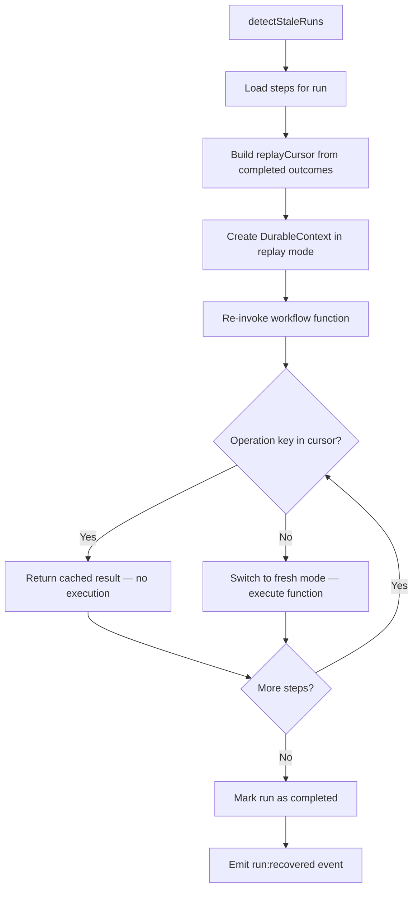

# Recovery Guide

Durable-agents provides automatic crash recovery for AI agent workflows. When a process dies mid-execution, the library detects the stale run and replays completed steps from the journal — no LLM calls are re-executed, no money is wasted.

This guide covers how crash detection works, what happens during recovery, and how to configure and trigger it.

---

## Crash Detection

### The Heartbeat Mechanism

Every active run periodically writes a timestamp to the journal store. This is the **heartbeat** — a simple "I'm still alive" signal.

```typescript
const workflow = new DurableWorkflow('my-agent', agentFn, {
  store,
  heartbeatIntervalMs: 10_000,  // write heartbeat every 10s
  staleTimeoutMs: 30_000,       // consider stale after 30s of silence
});
```

The `Heartbeat` class calls `store.updateHeartbeat(runId)` on a fixed interval. When the process crashes, the heartbeat stops. The run's last heartbeat timestamp freezes in the database.

### When Is a Run "Stale"?

A run is considered stale when:

```
now - lastHeartbeat > staleTimeoutMs
```

The `RecoveryEngine.detectStaleRuns()` method queries the store for all runs whose last heartbeat exceeds the configured timeout. These runs are candidates for recovery.

**Key insight:** The heartbeat interval must always be shorter than the stale timeout. If `heartbeatIntervalMs >= staleTimeoutMs`, the library rejects the config at construction time. A good rule of thumb is `staleTimeoutMs >= 3 × heartbeatIntervalMs` to avoid false positives from GC pauses or I/O spikes.

---

## RecoveryEngine Flow

When recovery is triggered (either automatically or manually), the `RecoveryEngine` follows this sequence:



### Step-by-step breakdown

1. **detectStaleRuns** — Query the store for runs where `now - lastHeartbeat > staleTimeoutMs`
2. **Load steps** — Fetch all steps belonging to the stale run, ordered by sequence
3. **Build replayCursor** — For each completed step, load its outcome records into a `Map<operationKey, OutcomeRecord>`
4. **Create DurableContext(replay)** — Instantiate a context with `mode: 'replay'` and the populated cursor
5. **Re-invoke fn** — Call the original workflow function with the recovery context and the original input
6. **Replay cached steps** — Each `ctx.step()` call checks the cursor; if a matching operation key exists, the cached result is returned immediately without executing the function
7. **Execute remaining fresh** — Once the cursor is exhausted, subsequent steps execute normally (fresh mode)
8. **Mark completed** — Update the run status to `completed` and increment the `recoveryCount`

---

## Replay Semantics

### What "Replay" Means

During recovery, the workflow function is called again from the beginning. But completed steps are **not re-executed**. Instead, each `ctx.step(name, fn)` call:

1. Computes the operation key: `SHA-256(runId + name + sequence)`
2. Checks if that key exists in the replay cursor
3. If found → returns the cached `result` from the journal (the `fn` is never called)
4. If not found → executes `fn` normally and records the outcome

This means your LLM calls, API requests, and expensive computations from before the crash are never repeated. The journal acts as a deterministic replay log.

### Operation Key Matching

Operation keys are deterministic. They depend on:

- **runId** — unique per execution
- **step name** — the string label you pass to `ctx.step()`
- **sequence number** — auto-incrementing counter within the run

As long as the workflow function calls steps in the same order with the same names, the keys will match. This is why step names and ordering must be stable across recovery.

### The Fresh/Replay Mode Switch

The context starts in `replay` mode. As steps execute:

- **Replay phase**: operation key found in cursor → return cached result, no side effects
- **Fresh phase**: operation key not found → execute the function, record the outcome to the journal

The switch from replay to fresh happens naturally as the cursor is exhausted. There is no explicit mode toggle — the cursor lookup determines the behavior.

---

## Configuration

### heartbeatIntervalMs

How often the heartbeat timestamp is written to the store during execution.

| Property | Value |
|----------|-------|
| Default | `10_000` (10 seconds) |
| Minimum | Must be > 0 |
| Constraint | Must be < `staleTimeoutMs` |

Lower values mean faster crash detection but more database writes.

### staleTimeoutMs

How long a run can go without a heartbeat before being considered stale.

| Property | Value |
|----------|-------|
| Default | `30_000` (30 seconds) |
| Minimum | Must be > `heartbeatIntervalMs` |

Higher values reduce false positives (e.g., during long GC pauses) but increase the delay before crash recovery begins.

### Relationship

```
heartbeatIntervalMs < staleTimeoutMs

Recommended: staleTimeoutMs >= 3 × heartbeatIntervalMs
```

Example configurations:

| Use Case | heartbeatIntervalMs | staleTimeoutMs |
|----------|-------------------|----------------|
| Fast detection (dev) | 2_000 | 10_000 |
| Standard (production) | 10_000 | 30_000 |
| Long-running agents | 30_000 | 120_000 |

---

## Auto-Recovery on Startup

Set `autoRecover: true` in `DurableWorkflowOptions` to automatically scan for and recover stale runs when the workflow is instantiated:

```typescript
const workflow = new DurableWorkflow('research-agent', agentFn, {
  store,
  heartbeatIntervalMs: 10_000,
  staleTimeoutMs: 30_000,
  autoRecover: true,
});
```

### Behavior

When `autoRecover` is enabled, the workflow:

1. Schedules recovery asynchronously (via `queueMicrotask`) — does not block construction
2. Calls `detectStaleRuns()` on the configured store
3. Filters to only runs matching this workflow's name (ignoring stale runs from other workflows)
4. Recovers each matching run sequentially, using the original input stored in the run's metadata
5. Isolates failures — if one run fails to recover, the engine continues with the remaining runs

This is useful for process restarts: when your server comes back up, it automatically picks up where it left off.

### Listening to recovery events

```typescript
workflow.on('run:recovered', (event) => {
  console.log(`Recovered run ${event.runId}`);
  console.log(`  Steps replayed: ${event.totalStepsRecovered}`);
  console.log(`  Resumed from step: ${event.recoveredFromStep}`);
});

workflow.on('run:failed', (event) => {
  console.error(`Recovery failed for ${event.runId}:`, event.error.message);
});
```

---

## Manual Recovery via CLI

For manual intervention (e.g., inspecting stale runs before recovering them), use the CLI:

```bash
npx durable-agents recover --db ./agent.db --timeout 30000
```

### Options

| Flag | Description | Default |
|------|-------------|---------|
| `--db <path>` | Path to SQLite database | `./durable-agents.db` |
| `--postgres <url>` | PostgreSQL connection string (use instead of `--db`) | — |
| `--timeout <ms>` | Stale timeout threshold in milliseconds | `30000` |

### Examples

```bash
# Recover stale runs from a SQLite database
npx durable-agents recover --db ./my-agent.db

# Recover with a custom timeout (2 minutes)
npx durable-agents recover --db ./my-agent.db --timeout 120000

# Recover from a PostgreSQL database
npx durable-agents recover --postgres postgresql://localhost:5432/agents
```

### Output

```
Found 2 stale run(s). Recovering...
  Stale run: a1b2c3d4 (research-agent)
  Stale run: e5f6g7h8 (summarize-agent)

Recovery summary: 2 found, 0 failed.
```

---

## Edge Cases

### Partial Failures in Parallel Steps

When `ctx.parallel()` is used and a crash occurs mid-execution:

- Steps that completed before the crash have their outcomes in the journal
- During recovery, completed parallel steps are replayed from the cursor
- Incomplete parallel steps are re-executed fresh
- If a parallel step fails during recovery, the entire `parallel()` call throws (same as fresh execution)

The replay cursor handles parallel steps individually — each has its own operation key based on `(runId, stepName, sequence)`.

### Recovery of Terminated Runs

Runs that were explicitly terminated (via `workflow.terminate()` or lifecycle controls like budget/loop detection) are **not** recovered. Only runs in `running` status with a stale heartbeat are candidates.

The `findStaleRuns()` query filters by:
- Status is `running` (not `completed`, `failed`, or `terminated`)
- Last heartbeat exceeds the stale timeout

### What Happens When Recovery Itself Fails

If the workflow function throws during recovery (after replaying cached steps):

1. The heartbeat is stopped
2. The run status is updated to `failed`
3. A `run:failed` event is emitted with the error and the last completed step sequence
4. The error is re-thrown to the caller

When using `autoRecover`, recovery failures are isolated per-run. The engine catches the error and continues recovering the next stale run. This prevents one poisoned run from blocking recovery of healthy runs.

### Duplicate Recovery Prevention

The heartbeat restarts during recovery. If two processes attempt to recover the same run concurrently, the second process will see the run's heartbeat has been refreshed and will no longer consider it stale. This provides natural deduplication without distributed locks.

### Non-Deterministic Workflow Changes

If the workflow function has changed between the original execution and recovery (e.g., steps were reordered or renamed), the operation keys will not match. The recovery will treat all steps as fresh and re-execute them. This is safe but defeats the purpose of replay — the previously cached results will be orphaned.

To avoid this, ensure workflow logic is stable before recovering stale runs from a previous deployment.
